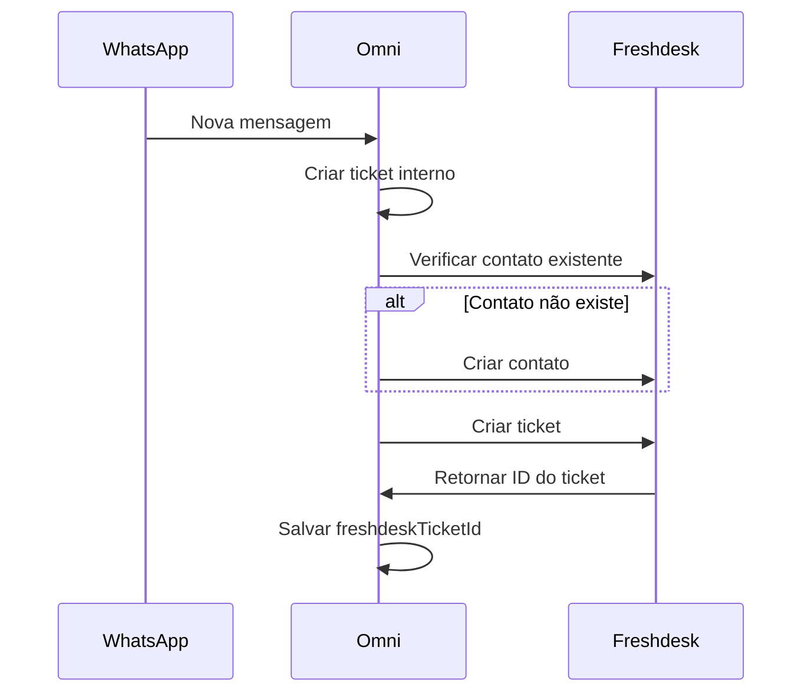
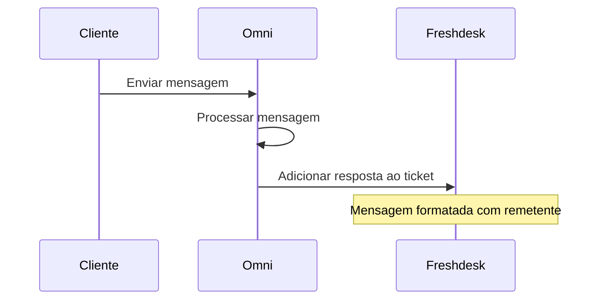
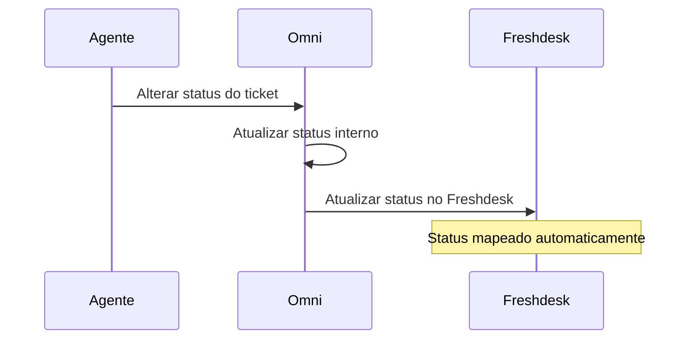

# 🚀 Guia de Integração Freshdesk baseada em Eventos

Este guia explica como implementar uma integração robusta e escalável com o Freshdesk usando o sistema de eventos do NestJS.

## 📋 **Visão Geral da Arquitetura**

```
[Tickets Service] 
       ↓ (emite eventos)
[Event System (@nestjs/event-emitter)]
       ↓ (escuta eventos)
[Freshdesk Event Listener] 
       ↓ (chama API)
[Freshdesk Service] 
       ↓ (sincroniza)
[Freshdesk Platform]
```

## 🔧 **Configuração Inicial**

### 1. **Configuração por Empresa**

Cada empresa configura seu próprio Freshdesk através da API de integrações:

```json
{
  "domain": "https://suaempresa.freshdesk.com",
  "api_key": "sua_api_key_freshdesk_aqui",
  "auto_responses": true,
  "priority_analysis": true,
  "business_hours_check": true,
  "ai_integration": true,
  "ticket_transfer": true,
  "contact_sync": true,
  "phone": "+5511999999999"
}
```

### 2. **Obter API Key do Freshdesk**

1. Faça login no seu Freshdesk
2. Vá para **Admin → API**
3. Gere uma nova chave ou use uma existente
4. Configure através do endpoint de integrações da sua API

### 3. **Configuração Já Existente** ✅

As configurações do Freshdesk são armazenadas no campo `config` (JSON) da tabela `integrations` existente. Não é necessário criar tabelas adicionais.

## 📂 **Estrutura de Arquivos Criados**

```
src/
├── integrations/
│   └── freshdesk/
│       ├── freshdesk.service.ts           # API calls para Freshdesk
│       ├── freshdesk-event.listener.ts    # Event listeners
│       └── freshdesk.module.ts            # Módulo principal
└── events/
    └── tickets.events.ts                  # Classes de eventos (já existia)
```

## 🎯 **Como Funciona**

### **1. Fluxo de Criação de Ticket**

```typescript
// 1. Ticket é criado no sistema interno
const ticket = await this.ticketRepository.save(newTicket);

// 2. Evento é emitido
this.eventEmitter.emit('ticket.created', new TicketCreatedEvent(...));

// 3. Listener escuta e executa ações no Freshdesk
@OnEvent('ticket.created')
async handleTicketCreated(event: TicketCreatedEvent) {
  // - Busca configuração da empresa no campo config (JSON)
  // - Cria/busca contato no Freshdesk
  // - Cria ticket no Freshdesk
}
```

### **2. Eventos Disponíveis**

| Evento | Quando é Disparado | Ação no Freshdesk |
|--------|-------------------|-------------------|
| `ticket.created` | Novo ticket criado | Cria ticket e contato |
| `ticket.message.created` | Nova mensagem adicionada | Adiciona nota/resposta |
| `ticket.status.changed` | Status do ticket alterado | Atualiza status |
| `human.assistance.requested` | IA solicita ajuda humana | Marca como urgente |

## 🔗 **Implementação nos Pontos de Emissão**

### **No TicketsService - Adicionando EventEmitter**

```typescript
// 1. Adicionar import
import { EventEmitter2 } from '@nestjs/event-emitter';
import { TicketCreatedEvent, ... } from '../events/tickets.events';

// 2. Injetar no construtor
constructor(
  // ... outros serviços
  private readonly eventEmitter: EventEmitter2,
) {}
```

### **Exemplo: Emitir evento quando ticket é criado**

```typescript
// Na função createNewTicket (linha ~682)
const savedTicket = await this.ticketRepository.save(newTicket);

// EMITIR EVENTO
this.eventEmitter.emit('ticket.created', new TicketCreatedEvent(
  savedTicket.id,
  buffer.customerId,
  buffer.companyId,
  buffer.customerName,
  buffer.customerPhone,
  buffer.messages.map(msg => ({ content: msg.content, type: msg.type }))
));
```

### **Exemplo: Emitir evento quando mensagem é criada**

```typescript
// Na função createNewMessage (linha ~608)
const savedMessage = await this.ticketMessageRepository.save(newTicketMessage);

this.eventEmitter.emit('ticket.message.created', new TicketMessageCreatedEvent(
  ticketId,
  ticket.companyId,
  message,
  messageType,
  senderType,
  senderName,
  ticket.freshdeskTicketId // campo adicional no ticket (se necessário)
));
```

## 🎛️ **Configurações Avançadas**

### **Mapeamento de Status**

O sistema mapeia automaticamente os status internos para o Freshdesk:

```typescript
// Status interno → Freshdesk
AI → 2 (Aberto)
IN_PROGRESS → 3 (Pendente)  
CLOSED → 5 (Fechado)
```

### **Mapeamento de Prioridades**

```typescript
// Prioridade interna → Freshdesk
LOW → 1
MEDIUM → 2
HIGH → 3
URGENT → 4
```

### **Funcionalidades Configuráveis**

| Campo | Descrição | Comportamento |
|-------|-----------|---------------|
| `auto_responses` | Respostas Automáticas | Ativa respostas automáticas baseadas em horário |
| `priority_analysis` | Análise de Prioridade | Analisa prioridade dos tickets automaticamente |
| `business_hours_check` | Horário de Funcionamento | Verifica horário antes de enviar mensagens |
| `ai_integration` | Integração com IA | Permite que a IA responda mensagens automaticamente |
| `ticket_transfer` | Transferência de Tickets | Gerencia transferência de tickets entre status |
| `contact_sync` | Sincronização de Contatos | Sincroniza contatos entre sistemas |

### **Lógica Condicional dos Eventos**

```typescript
// Exemplo: Criação de ticket com verificações condicionais
@OnEvent('ticket.created')
async handleTicketCreated(event: TicketCreatedEvent) {
  const config = await this.getFreshdeskConfig(event.companyId);
  
  // 1. Sincronização de contatos (se habilitada)
  if (config.contact_sync !== false) {
    // Busca/cria contato no Freshdesk
  }
  
  // 2. Análise de prioridade (se habilitada)
  if (config.priority_analysis) {
    // Analisa palavras-chave para definir prioridade
  }
  
  // 3. Cria ticket com configurações aplicadas
}
```

### **Campos Personalizados**

O sistema salva informações do ticket interno como campos personalizados:

```typescript
custom_fields: {
  omni_ticket_id: event.ticketId,
  omni_company_id: event.companyId,
  customer_phone: event.customerPhone,
}
```

## 🔍 **Monitoramento e Logs**

O sistema inclui logs detalhados para rastreamento:

```typescript
// Logs automáticos incluem:
- "Processando evento ticket.created para ticket X"
- "Contato criado no Freshdesk: Y"
- "Ticket criado no Freshdesk: Z"
- "Erro ao processar evento: ..."
```

## 🚦 **Próximos Passos**

### **1. Implementação Básica**
- [ ] Configurar integração Freshdesk via API (/integrations/freshdesk)
- [ ] Adicionar imports no `TicketsService`
- [ ] Implementar emissão de eventos em pontos-chave
- [ ] (Opcional) Adicionar campo `freshdeskTicketId` na entidade Ticket

### **Exemplo de Configuração Completa**

```bash
POST /integrations/freshdesk
{
  "domain": "https://minhaempresa.freshdesk.com",
  "api_key": "gAn123xyz456",
  "auto_responses": true,          // Habilita respostas automáticas
  "priority_analysis": true,       // Analisa prioridade automaticamente
  "business_hours_check": true,    // Verifica horário comercial
  "ai_integration": false,         // Desabilita mensagens da IA
  "ticket_transfer": true,         // Permite transferência de status
  "contact_sync": true,            // Sincroniza contatos
  "phone": "+5511988776655"        // Telefone de contato
}
```

**Resultado:** A empresa terá uma integração personalizada que:
- ✅ Cria tickets com prioridade inteligente
- ✅ Sincroniza contatos automaticamente  
- ✅ Respeita horário comercial para respostas
- ❌ Não processa mensagens da IA
- ✅ Sincroniza mudanças de status

### **2. Funcionalidades Avançadas**
- [ ] Webhook reverso (receber atualizações do Freshdesk)
- [ ] Retry automático em caso de falha
- [ ] Dashboard de sincronização
- [ ] Sincronização histórica de tickets

### **3. Outras Integrações**
- [ ] Zendesk (usando a mesma arquitetura)
- [ ] Intercom
- [ ] ServiceNow

## ⚡ **Vantagens desta Abordagem**

1. **Desacoplamento**: Serviços não dependem diretamente da integração
2. **Escalabilidade**: Fácil adicionar novas integrações
3. **Resilência**: Eventos podem ser reprocessados em caso de falha
4. **Auditoria**: Logs completos de todas as operações
5. **Flexibilidade**: Cada integração pode ter sua própria lógica

## 🐛 **Troubleshooting**

### **Problemas Comuns**

1. **"Freshdesk API Key inválida"**
   - Verifique se a API key está correta
   - Confirme se o domínio está no formato correto

2. **"Eventos não estão sendo processados"**
   - Verifique se o `EventEmitterModule` está importado
   - Confirme se o listener está registrado como provider

3. **"Ticket não encontrado no Freshdesk"**
   - Verifique se a integração Freshdesk está ativa para a empresa
   - Confirme se o ticket foi criado com sucesso
   - Verifique os logs de sincronização

### **Logs para Debug**

```bash
# Filtrar logs relacionados ao Freshdesk
grep "Freshdesk" logs/application.log

# Ver eventos sendo processados
grep "Processando evento" logs/application.log
```

## 📞 **Suporte**

Este sistema foi projetado para ser robusto e auto-suficiente. Em caso de dúvidas:

1. Consulte os logs detalhados
2. Verifique a documentação da API do Freshdesk
3. Teste com tickets simples primeiro
4. Use o ambiente de desenvolvimento para validar

---

## 🎉 **Resumo das Funcionalidades Implementadas**

### ✅ **Recursos Disponíveis:**
1. **Configuração por Empresa** - Cada empresa tem suas próprias credenciais e configurações
2. **Sincronização Condicional** - Funcionalidades podem ser habilitadas/desabilitadas individualmente
3. **Análise Inteligente** - Prioridade automática baseada em palavras-chave
4. **Horário Comercial** - Respeita configurações de tempo para respostas automáticas
5. **Controle de IA** - Permite filtrar mensagens da inteligência artificial
6. **Transferência Flexível** - Sincronização de status pode ser desabilitada
7. **Gestão de Contatos** - Sincronização opcional entre sistemas

### 🔧 **Campos do DTO Implementados:**
```typescript
{
  domain: string,              // Obrigatório
  api_key: string,             // Obrigatório
  auto_responses?: boolean,    // Opcional
  priority_analysis?: boolean, // Opcional
  business_hours_check?: boolean, // Opcional
  ai_integration?: boolean,    // Opcional
  ticket_transfer?: boolean,   // Opcional
  contact_sync?: boolean,      // Opcional
  phone?: string              // Opcional
}
```

**🎉 Pronto! Sua integração Freshdesk baseada em eventos está configurada e pronta para escalar!**

# Integração Freshdesk - Guia Completo

## Visão Geral

A integração Freshdesk permite sincronizar automaticamente tickets, contatos e mensagens entre o sistema Omni e o Freshdesk. Esta integração garante que todas as interações do WhatsApp sejam refletidas no sistema de help desk do Freshdesk.

## Recursos Disponíveis

### 1. Sincronização de Contatos
- Busca contatos existentes no Freshdesk por número de telefone
- Criação automática de contatos quando não existem
- Vinculação de contatos aos tickets criados

### 2. Criação de Tickets
- Criação automática de tickets no Freshdesk quando um novo atendimento é iniciado
- Formatação das mensagens iniciais na descrição do ticket
- Configuração de campos personalizados para rastreamento

### 3. Sincronização de Mensagens
- Todas as mensagens trocadas são sincronizadas como respostas no Freshdesk
- Identificação clara do remetente (Cliente, Agente, IA)
- Formatação adequada das mensagens

### 4. Atualização de Status
- Sincronização automática de mudanças de status
- Mapeamento inteligente entre status do Omni e Freshdesk
- Controle granular sobre quais status sincronizar

## Configuração

### Pré-requisitos

1. **Conta Freshdesk ativa** com permissões de API
2. **API Key** do Freshdesk
3. **Domínio** do Freshdesk (exemplo: `https://empresa.freshdesk.com`)

### Obtenção da API Key

1. Acesse sua conta Freshdesk
2. Vá para **Perfil** > **Configurações**
3. Copie a **API Key** exibida

### Configuração no Sistema

A integração é configurada através do endpoint de integrações:

```json
{
  "type": "FRESHDESK",
  "config": {
    "domain": "https://sua-empresa.freshdesk.com",
    "api_key": "sua-api-key-aqui",
    "priority_analysis": true,
    "ticket_creation": true,
    "ticket_close": true,
    "contact_sync": true
  },
  "isActive": true
}
```

### Parâmetros de Configuração

| Parâmetro | Tipo | Obrigatório | Descrição |
|-----------|------|-------------|-----------|
| `domain` | string | ✅ | URL completa do seu Freshdesk |
| `api_key` | string | ✅ | API Key do Freshdesk |
| `priority_analysis` | boolean | ❌ | Habilita análise de prioridade automática |
| `ticket_creation` | boolean | ❌ | Habilita criação automática de tickets |
| `ticket_close` | boolean | ❌ | Habilita sincronização de fechamento |
| `contact_sync` | boolean | ❌ | Habilita sincronização de contatos |

**Valores padrão:** Todos os parâmetros opcionais são `false` por padrão.

## Fluxo de Funcionamento

### 1. Criação de Ticket



### 2. Sincronização de Mensagens



### 3. Atualização de Status



## Mapeamento de Status

| Status Omni | Status Freshdesk | Valor |
|-------------|------------------|--------|
| `AI` | Aberto | 2 |
| `IN_PROGRESS` | Pendente | 3 |
| `CLOSED` | Fechado | 5 |

## Eventos Sincronizados

### ticket.created
- **Quando:** Novo ticket é criado no sistema
- **Ação:** Cria ticket correspondente no Freshdesk
- **Dependências:** `ticket_creation` deve estar habilitado

### ticket.message.created
- **Quando:** Nova mensagem é adicionada ao ticket
- **Ação:** Adiciona resposta ao ticket no Freshdesk
- **Formato:** `**NomeRemetente** (TipoRemetente):\n\nConteúdo`

### ticket.status.changed
- **Quando:** Status do ticket é alterado
- **Ação:** Atualiza status no Freshdesk
- **Dependências:** `ticket_close` para fechamentos

### customer.created
- **Quando:** Novo cliente é criado no sistema
- **Ação:** Cria contato no Freshdesk
- **Dependências:** `contact_sync` deve estar habilitado

## Campos Personalizados

O sistema adiciona automaticamente os seguintes campos personalizados aos tickets:

```json
{
  "custom_fields": {
    "omnify_ticket_id": 123,
    "omnify_company_id": 456,
    "customer_phone": "+5511999999999"
  }
}
```

## Tratamento de Erros

### Logs de Erro
- Todos os erros são registrados com detalhes completos
- Inclui status HTTP e dados da resposta
- Não interrompe o fluxo normal do sistema

### Cenários de Erro Comuns

1. **API Key inválida**
   - Status: 401
   - Ação: Verificar configuração

2. **Domínio incorreto**
   - Status: 404
   - Ação: Verificar URL do Freshdesk

3. **Campos obrigatórios ausentes**
   - Status: 400
   - Ação: Verificar estrutura dos dados

4. **Limite de rate exceeded**
   - Status: 429
   - Ação: Aguardar e tentar novamente

## Monitoramento

### Logs Disponíveis

```bash
# Ver logs da integração
grep "Freshdesk" /var/log/omni/app.log

# Filtrar por eventos específicos
grep "ticket.created" /var/log/omni/app.log
grep "ticket.message.created" /var/log/omni/app.log
grep "ticket.status.changed" /var/log/omni/app.log
```

### Métricas Importantes

- Taxa de sucesso na criação de tickets
- Tempo de resposta da API Freshdesk
- Número de erros de sincronização
- Volume de mensagens sincronizadas

## Solução de Problemas

### Problema: Tickets não são criados no Freshdesk

**Causas possíveis:**
1. `ticket_creation` está desabilitado
2. API Key inválida
3. Domínio incorreto
4. Campos obrigatórios ausentes

**Solução:**
1. Verificar configuração da integração
2. Testar API Key manualmente
3. Verificar logs de erro detalhados

### Problema: Mensagens não são sincronizadas

**Causas possíveis:**
1. Ticket não possui `freshdeskTicketId`
2. Ticket não existe no Freshdesk
3. Permissões insuficientes

**Solução:**
1. Verificar se o ticket foi criado corretamente
2. Confirmar permissões da API Key
3. Verificar logs de erro

### Problema: Status não é atualizado

**Causas possíveis:**
1. `ticket_close` desabilitado para fechamentos
2. Ticket não existe no Freshdesk
3. Status não mapeado corretamente

**Solução:**
1. Verificar configuração de sincronização
2. Confirmar mapeamento de status
3. Verificar logs de erro

## Exemplo de Uso

### Configuração Básica

```javascript
// Configurar integração via API
const integrationConfig = {
  type: 'FRESHDESK',
  config: {
    domain: 'https://minhaempresa.freshdesk.com',
    api_key: 'minha-api-key',
    ticket_creation: true,
    contact_sync: true,
    ticket_close: true
  },
  isActive: true
};

// Enviar via POST para /integrations
```

### Configuração Avançada

```javascript
const advancedConfig = {
  type: 'FRESHDESK',
  config: {
    domain: 'https://minhaempresa.freshdesk.com',
    api_key: 'minha-api-key',
    priority_analysis: true,    // Análise de prioridade
    ticket_creation: true,      // Criação automática
    ticket_close: true,         // Sincronização de fechamento
    contact_sync: true          // Sincronização de contatos
  },
  isActive: true
};
```

## Limitações

1. **Rate Limiting:** Freshdesk possui limites de API que devem ser respeitados
2. **Campos Personalizados:** Alguns campos podem precisar ser configurados manualmente no Freshdesk
3. **Permissões:** A API Key deve ter permissões suficientes para todas as operações
4. **Sincronização Unidirecional:** Mudanças no Freshdesk não são sincronizadas de volta

## Suporte

Para problemas ou dúvidas relacionadas à integração Freshdesk:

1. Verificar logs de erro detalhados
2. Confirmar configurações de API
3. Testar conectividade com Freshdesk
4. Contactar suporte técnico se necessário

## Atualizações

- **v1.0.0:** Implementação inicial
- **v1.1.0:** Melhorias no tratamento de erros
- **v1.2.0:** Adição de campos personalizados
- **v1.3.0:** Configuração granular de sincronização 